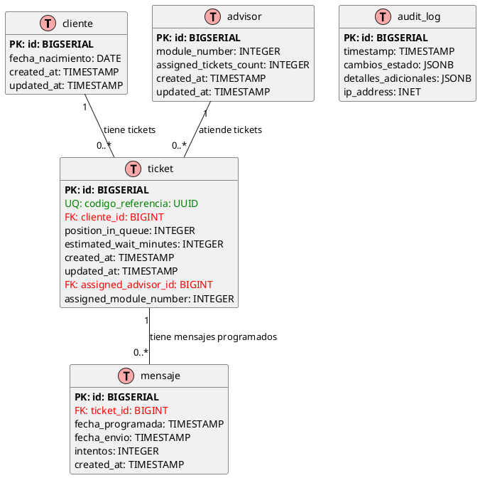

# Modelo de Datos - Sistema Ticketero Digital

**Proyecto:** Sistema de Gestión de Tickets con Notificaciones en Tiempo Real  
**Versión:** 1.0  
**Fecha:** Diciembre 2025  
**Arquitecto:** Arquitecto de Software Senior

---

## 1. Introducción

Este documento especifica el modelo de datos normalizado del Sistema Ticketero Digital, diseñado para garantizar integridad referencial, eliminar redundancia y optimizar el rendimiento de consultas. El modelo sigue las mejores prácticas de normalización hasta 3FN (Tercera Forma Normal).

## 2. Diagrama Entidad-Relación



**Archivo fuente:** docs/diagrams/03-er-diagram.puml

## 3. Especificación de Entidades

### 3.1 Entidad: cliente

**Propósito:** Almacenar información personal de los clientes que utilizan el sistema.

**Campos:**
- `id` (BIGSERIAL, PK): Identificador único interno
- `national_id` (VARCHAR(20), UNIQUE): RUT/ID nacional del cliente
- `nombre` (VARCHAR(100)): Nombre del cliente
- `apellido` (VARCHAR(100)): Apellido del cliente
- `telefono` (VARCHAR(20)): Número de teléfono para Telegram
- `email` (VARCHAR(100)): Correo electrónico (futuras notificaciones)
- `fecha_nacimiento` (DATE): Fecha de nacimiento
- `created_at` (TIMESTAMP): Fecha de registro
- `updated_at` (TIMESTAMP): Última actualización

**Reglas de Negocio:**
- RN-001: Un cliente solo puede tener 1 ticket activo a la vez
- national_id debe ser único en el sistema
- telefono es opcional (cliente puede no querer notificaciones)

**Índices:**
```sql
CREATE UNIQUE INDEX idx_cliente_national_id ON cliente(national_id);
CREATE INDEX idx_cliente_telefono ON cliente(telefono);
CREATE INDEX idx_cliente_created_at ON cliente(created_at);
```

### 3.2 Entidad: ticket

**Propósito:** Representar cada ticket/turno creado en el sistema.

**Campos:**
- `id` (BIGSERIAL, PK): Identificador único interno
- `codigo_referencia` (UUID, UNIQUE): Identificador público del ticket
- `numero` (VARCHAR(10), UNIQUE): Número visible del ticket (C01, P15, etc.)
- `cliente_id` (BIGINT, FK): Referencia al cliente
- `branch_office` (VARCHAR(100)): Nombre de la sucursal
- `queue_type` (VARCHAR(20)): Tipo de cola (CAJA, PERSONAL_BANKER, etc.)
- `status` (VARCHAR(20)): Estado actual del ticket
- `position_in_queue` (INTEGER): Posición actual en cola
- `estimated_wait_minutes` (INTEGER): Tiempo estimado de espera
- `created_at` (TIMESTAMP): Fecha/hora de creación
- `updated_at` (TIMESTAMP): Última actualización
- `assigned_advisor_id` (BIGINT, FK): Asesor asignado (nullable)
- `assigned_module_number` (INTEGER): Número de módulo (nullable)

**Reglas de Negocio:**
- RN-005: Formato número: [Prefijo][01-99]
- RN-009: Estados válidos: EN_ESPERA, PROXIMO, ATENDIENDO, COMPLETADO, CANCELADO, NO_ATENDIDO
- RN-010: Cálculo tiempo estimado: positionInQueue × tiempoPromedioCola

**Índices:**
```sql
CREATE UNIQUE INDEX idx_ticket_codigo_referencia ON ticket(codigo_referencia);
CREATE UNIQUE INDEX idx_ticket_numero ON ticket(numero);
CREATE INDEX idx_ticket_cliente_id ON ticket(cliente_id);
CREATE INDEX idx_ticket_status ON ticket(status);
CREATE INDEX idx_ticket_queue_type_status ON ticket(queue_type, status);
CREATE INDEX idx_ticket_created_at ON ticket(created_at);
```

### 3.3 Entidad: mensaje

**Propósito:** Gestionar mensajes programados para envío vía Telegram.

**Campos:**
- `id` (BIGSERIAL, PK): Identificador único
- `ticket_id` (BIGINT, FK): Referencia al ticket
- `plantilla` (VARCHAR(50)): Tipo de mensaje (totem_ticket_creado, etc.)
- `estado_envio` (VARCHAR(20)): Estado del envío (PENDIENTE, ENVIADO, FALLIDO)
- `fecha_programada` (TIMESTAMP): Cuándo debe enviarse
- `fecha_envio` (TIMESTAMP): Cuándo se envió realmente (nullable)
- `telegram_message_id` (VARCHAR(50)): ID retornado por Telegram (nullable)
- `intentos` (INTEGER): Contador de reintentos
- `created_at` (TIMESTAMP): Fecha de creación

**Reglas de Negocio:**
- RN-007: Máximo 3 reintentos automáticos
- RN-008: Backoff exponencial: 30s, 60s, 120s

**Índices:**
```sql
CREATE INDEX idx_mensaje_ticket_id ON mensaje(ticket_id);
CREATE INDEX idx_mensaje_estado_fecha ON mensaje(estado_envio, fecha_programada);
CREATE INDEX idx_mensaje_plantilla ON mensaje(plantilla);
```

### 3.4 Entidad: advisor

**Propósito:** Representar asesores/ejecutivos que atienden clientes.

**Campos:**
- `id` (BIGSERIAL, PK): Identificador único
- `name` (VARCHAR(100)): Nombre completo del asesor
- `email` (VARCHAR(100)): Correo electrónico
- `status` (VARCHAR(20)): Estado actual (AVAILABLE, BUSY, OFFLINE)
- `module_number` (INTEGER): Número de módulo asignado (1-5)
- `assigned_tickets_count` (INTEGER): Contador de tickets asignados
- `created_at` (TIMESTAMP): Fecha de registro
- `updated_at` (TIMESTAMP): Última actualización

**Reglas de Negocio:**
- RN-004: Balanceo de carga por assignedTicketsCount
- RN-013: Estados válidos: AVAILABLE, BUSY, OFFLINE

**Índices:**
```sql
CREATE INDEX idx_advisor_status ON advisor(status);
CREATE INDEX idx_advisor_assigned_count ON advisor(assigned_tickets_count);
CREATE INDEX idx_advisor_module ON advisor(module_number);
```

### 3.5 Entidad: audit_log

**Propósito:** Registrar todos los eventos del sistema para auditoría y trazabilidad.

**Campos:**
- `id` (BIGSERIAL, PK): Identificador único
- `timestamp` (TIMESTAMP): Fecha/hora del evento
- `tipo_evento` (VARCHAR(50)): Tipo de evento (TICKET_CREADO, etc.)
- `actor` (VARCHAR(100)): Quién ejecutó la acción
- `entity_type` (VARCHAR(50)): Tipo de entidad afectada
- `entity_id` (VARCHAR(50)): ID de la entidad afectada
- `cambios_estado` (JSONB): Estado anterior y nuevo
- `detalles_adicionales` (JSONB): Información adicional
- `ip_address` (INET): Dirección IP del origen

**Reglas de Negocio:**
- RN-011: Auditoría obligatoria para eventos críticos
- Retención: 12 meses mínimo

**Índices:**
```sql
CREATE INDEX idx_audit_timestamp ON audit_log(timestamp);
CREATE INDEX idx_audit_entity ON audit_log(entity_type, entity_id);
CREATE INDEX idx_audit_tipo_evento ON audit_log(tipo_evento);
CREATE INDEX idx_audit_actor ON audit_log(actor);
```

## 4. Relaciones y Cardinalidades

### 4.1 cliente → ticket (1:N)
- Un cliente puede tener múltiples tickets históricos
- Solo 1 ticket activo a la vez (RN-001)
- Integridad referencial: ON DELETE RESTRICT

### 4.2 ticket → mensaje (1:N)
- Un ticket tiene exactamente 3 mensajes programados
- Cascada: ON DELETE CASCADE (si se elimina ticket, se eliminan mensajes)

### 4.3 advisor → ticket (1:N)
- Un asesor puede atender múltiples tickets
- Solo 1 ticket ATENDIENDO simultáneamente
- Integridad referencial: ON DELETE SET NULL

## 5. Normalización

### 5.1 Primera Forma Normal (1FN)
✅ **Cumplida:** Todos los campos contienen valores atómicos, sin grupos repetitivos.

### 5.2 Segunda Forma Normal (2FN)
✅ **Cumplida:** Todas las dependencias parciales eliminadas. Cada entidad tiene clave primaria única.

### 5.3 Tercera Forma Normal (3FN)
✅ **Cumplida:** Eliminadas dependencias transitivas:
- Datos del cliente separados de ticket
- Información del asesor separada de ticket
- Mensajes en entidad independiente

## 6. Consideraciones de Rendimiento

### 6.1 Particionamiento
**Tabla audit_log:** Particionamiento por timestamp (mensual)
```sql
CREATE TABLE audit_log_2025_01 PARTITION OF audit_log
FOR VALUES FROM ('2025-01-01') TO ('2025-02-01');
```

### 6.2 Índices Compuestos
**Consultas frecuentes optimizadas:**
```sql
-- Para scheduler de mensajes
CREATE INDEX idx_mensaje_scheduler ON mensaje(estado_envio, fecha_programada) 
WHERE estado_envio = 'PENDIENTE';

-- Para asignación de tickets
CREATE INDEX idx_ticket_assignment ON ticket(queue_type, status, created_at) 
WHERE status = 'EN_ESPERA';

-- Para balanceo de asesores
CREATE INDEX idx_advisor_assignment ON advisor(status, assigned_tickets_count) 
WHERE status = 'AVAILABLE';
```

## 7. Constraints y Validaciones

### 7.1 Check Constraints
```sql
-- Estados válidos de ticket
ALTER TABLE ticket ADD CONSTRAINT chk_ticket_status 
CHECK (status IN ('EN_ESPERA', 'PROXIMO', 'ATENDIENDO', 'COMPLETADO', 'CANCELADO', 'NO_ATENDIDO'));

-- Tipos de cola válidos
ALTER TABLE ticket ADD CONSTRAINT chk_queue_type 
CHECK (queue_type IN ('CAJA', 'PERSONAL_BANKER', 'EMPRESAS', 'GERENCIA'));

-- Estados válidos de asesor
ALTER TABLE advisor ADD CONSTRAINT chk_advisor_status 
CHECK (status IN ('AVAILABLE', 'BUSY', 'OFFLINE'));

-- Módulos válidos (1-5)
ALTER TABLE advisor ADD CONSTRAINT chk_module_number 
CHECK (module_number BETWEEN 1 AND 5);

-- Posición en cola positiva
ALTER TABLE ticket ADD CONSTRAINT chk_position_positive 
CHECK (position_in_queue > 0);
```

### 7.2 Foreign Key Constraints
```sql
-- ticket → cliente
ALTER TABLE ticket ADD CONSTRAINT fk_ticket_cliente 
FOREIGN KEY (cliente_id) REFERENCES cliente(id) ON DELETE RESTRICT;

-- ticket → advisor
ALTER TABLE ticket ADD CONSTRAINT fk_ticket_advisor 
FOREIGN KEY (assigned_advisor_id) REFERENCES advisor(id) ON DELETE SET NULL;

-- mensaje → ticket
ALTER TABLE mensaje ADD CONSTRAINT fk_mensaje_ticket 
FOREIGN KEY (ticket_id) REFERENCES ticket(id) ON DELETE CASCADE;
```

## 8. Estimaciones de Volumen

### 8.1 Crecimiento Esperado (Fase Piloto)
- **Clientes:** 500-800 únicos/día → 20,000/mes
- **Tickets:** 500-800/día → 20,000/mes
- **Mensajes:** 1,500-2,400/día → 60,000/mes
- **Audit_log:** 3,000-5,000/día → 120,000/mes

### 8.2 Tamaño de Almacenamiento
- **cliente:** ~200 bytes/registro → 4MB/mes
- **ticket:** ~300 bytes/registro → 6MB/mes
- **mensaje:** ~250 bytes/registro → 15MB/mes
- **audit_log:** ~500 bytes/registro → 60MB/mes

**Total estimado:** ~85MB/mes (Fase Piloto)

## 9. Scripts de Migración

### 9.1 Orden de Creación
```sql
-- 1. Tablas independientes
CREATE TABLE cliente (...);
CREATE TABLE advisor (...);

-- 2. Tablas con dependencias
CREATE TABLE ticket (...);
CREATE TABLE mensaje (...);
CREATE TABLE audit_log (...);

-- 3. Índices
CREATE INDEX ...;

-- 4. Constraints
ALTER TABLE ... ADD CONSTRAINT ...;
```

### 9.2 Datos Iniciales
```sql
-- Asesores de ejemplo
INSERT INTO advisor (name, email, status, module_number, assigned_tickets_count) VALUES
('Juan Pérez', 'juan.perez@banco.com', 'AVAILABLE', 1, 0),
('Ana García', 'ana.garcia@banco.com', 'AVAILABLE', 2, 0),
('Luis Martínez', 'luis.martinez@banco.com', 'AVAILABLE', 3, 0);
```

## 10. Validación del Modelo

### 10.1 Checklist de Completitud
- ✅ 5 entidades definidas completamente
- ✅ Todas las relaciones especificadas (1:N)
- ✅ Índices para consultas críticas
- ✅ Constraints de integridad
- ✅ Normalización hasta 3FN
- ✅ Consideraciones de rendimiento
- ✅ Estimaciones de volumen

### 10.2 Casos de Uso Cubiertos
- ✅ Creación de ticket con datos cliente
- ✅ Consulta histórica de tickets por cliente
- ✅ Asignación automática de asesores
- ✅ Programación y envío de mensajes
- ✅ Auditoría completa de eventos
- ✅ Dashboard administrativo

---

**Documento completado exitosamente**  
**Estado:** Listo para implementación con Flyway  
**Próximo paso:** Generación de scripts SQL de migración